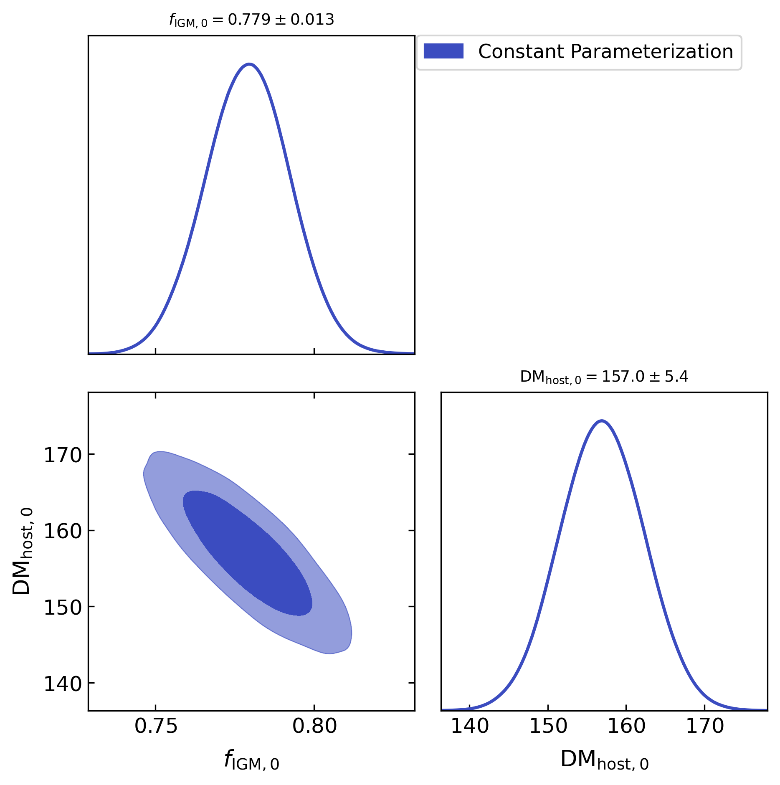
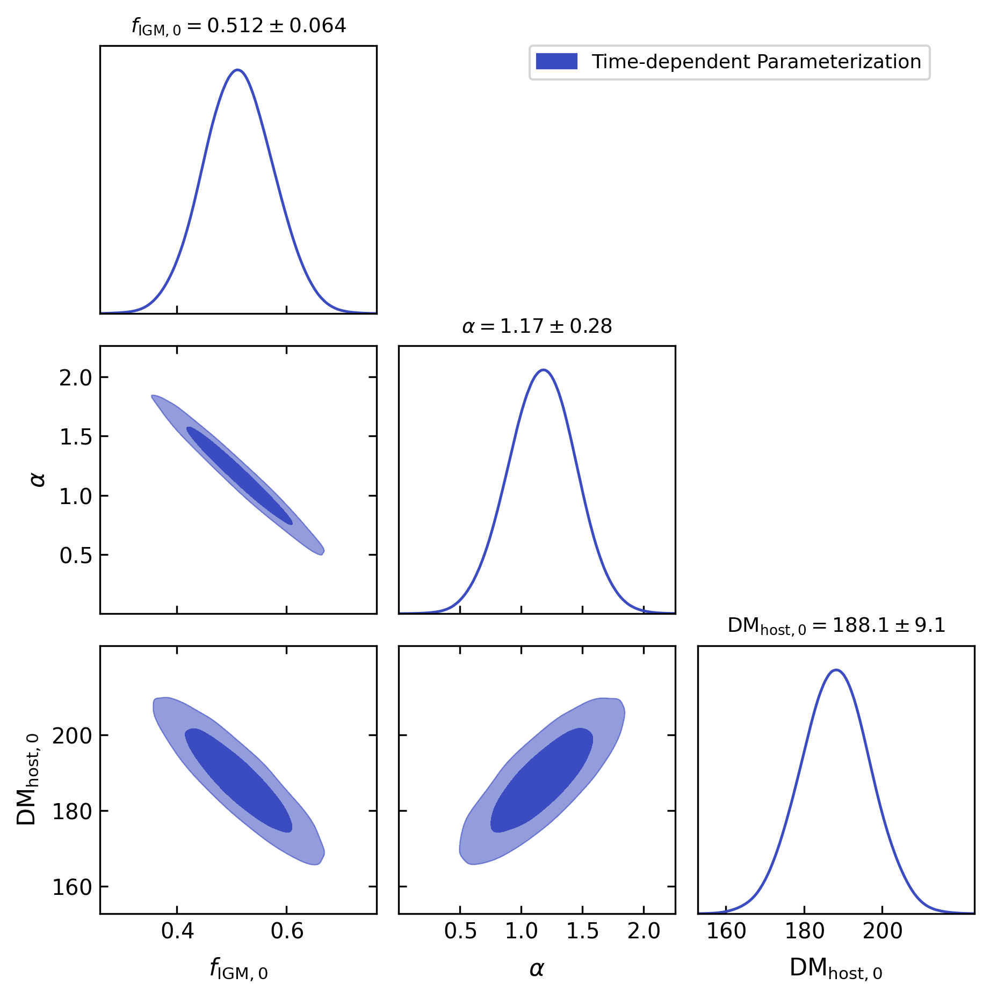
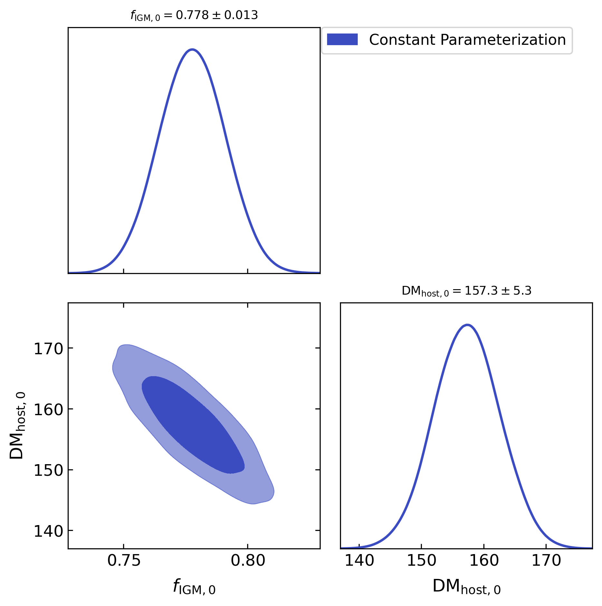
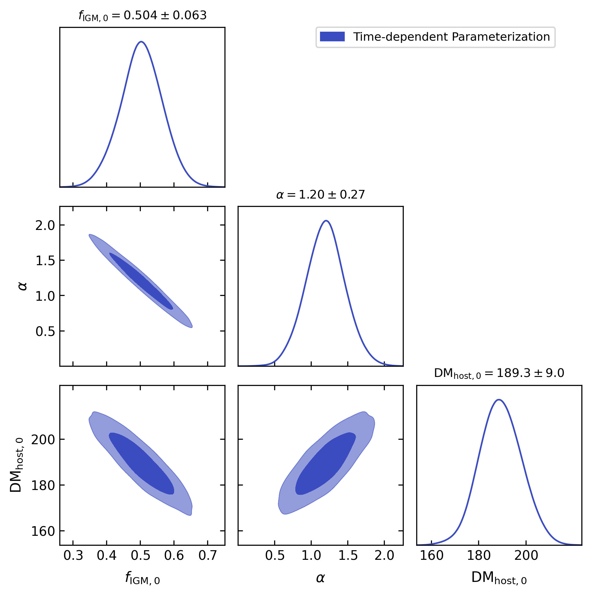
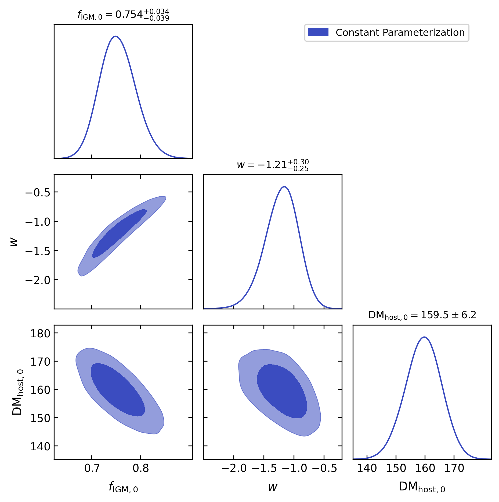
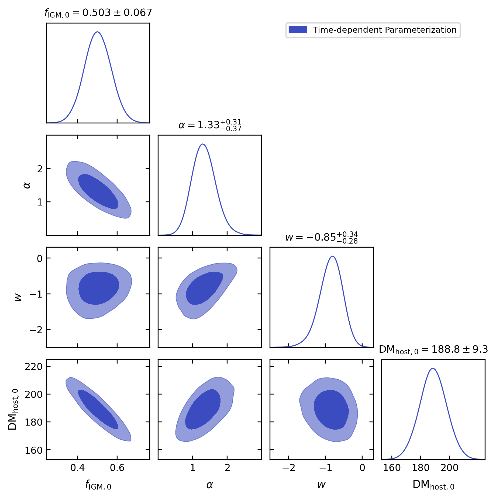
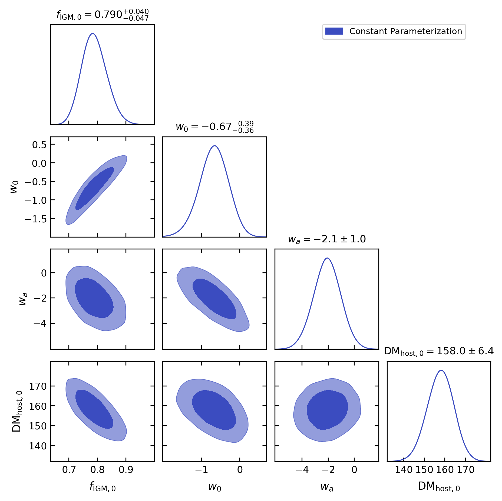
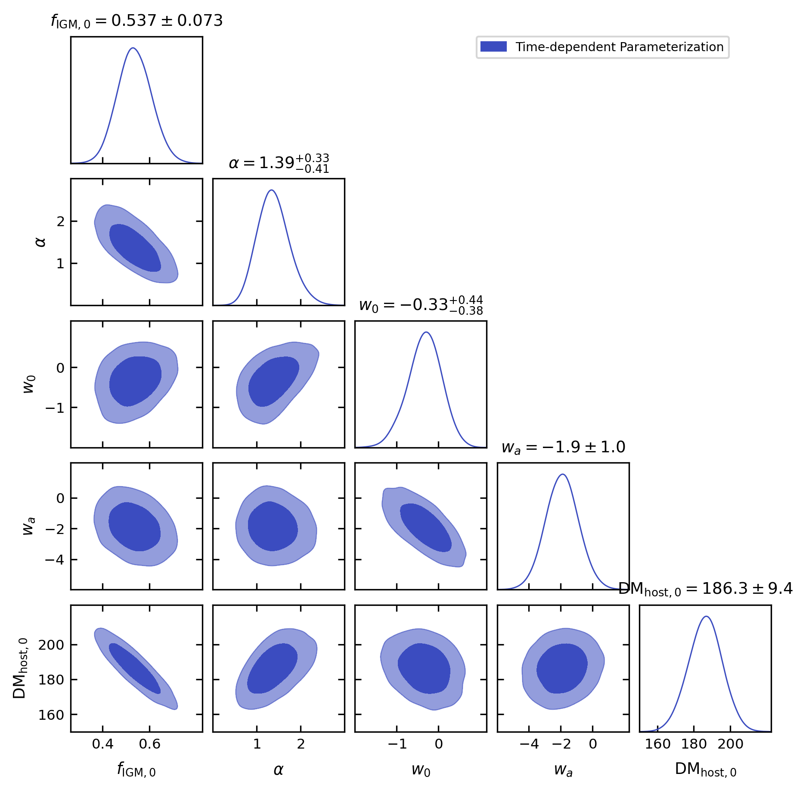
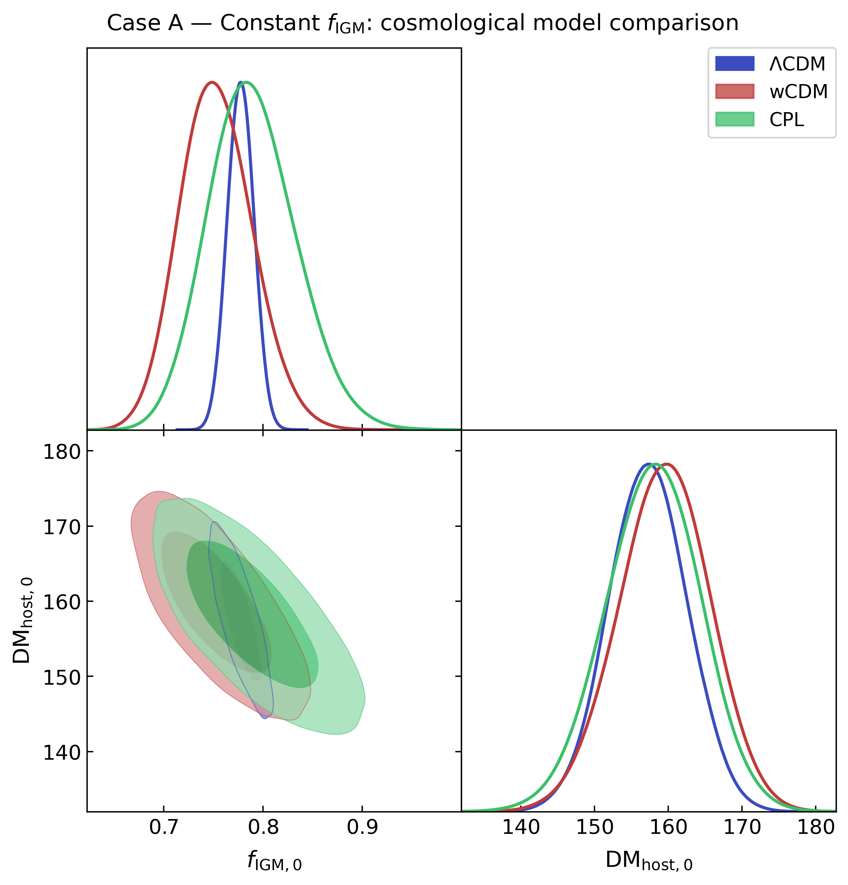
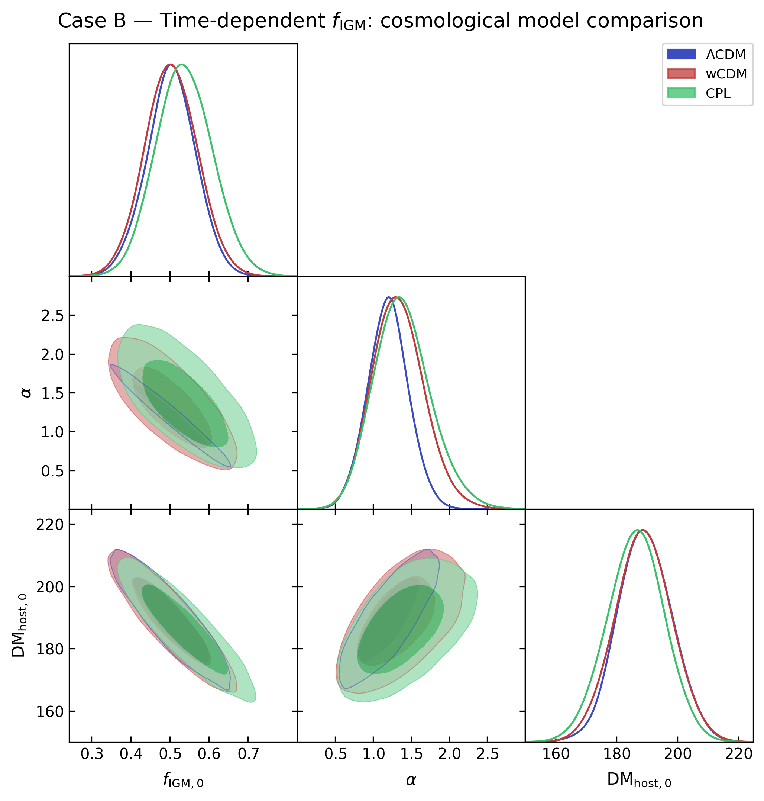

# Cosmological Parameter Constraints from Fast Radio Burst Data

This repository contains the analysis code for constraining cosmological 
parameters and the intergalactic baryon fraction using Fast Radio Burst (FRB) 
dispersion measure observations. The analysis uses Bayesian inference with 
MCMC (emcee) for parameter estimation and nested sampling (dynesty) for 
model comparison via Bayesian evidence.

## Models

Four cosmological frameworks are explored, each with two cases:
- **Case A**: constant intergalactic baryon fraction
- **Case B**: time-evolving intergalactic baryon fraction

The frameworks are:
- **Model-independent**: no cosmological model assumed
- **ΛCDM**: standard cosmological constant
- **wCDM**: constant dark energy equation of state w
- **CPL**: evolving dark energy with parameters w0 and wa

In all model-dependent analyses (ΛCDM, wCDM, CPL), the matter density 
and Hubble constant are fixed at fiducial values:

```
H0 = 74.03 km/s/Mpc
Om = 0.315
```

The fitted parameters depend on the model: ΛCDM fits only the baryon 
fraction, wCDM adds w, and CPL fits w0 and wa jointly.

## Physics

The observed extragalactic dispersion measure is modelled as:

$$
\mathrm{DM}_{\rm ext}(z) = \mathrm{DM}_{\rm IGM}(z) + \mathrm{DM}_{\rm host}(z)
$$

where the IGM contribution is:

$$
\mathrm{DM}_{\rm IGM}(z) = \frac{3c\Omega_b H_0^2}{8\pi G m_p}
\int_0^z \frac{(1+z') f_{\rm IGM}(z')}{H(z')} dz'
$$

Two parameterisations of the intergalactic baryon fraction are considered:

$$
f_{\rm IGM}(z) = f_{\rm IGM,0} \quad \text{(Case A, constant)}
$$

$$
f_{\rm IGM}(z) = f_{\rm IGM, 0} + \alpha\\frac{z}{1+z} \quad \text{(Case B, time-dependent)}
$$


## Notebooks

| Notebook | Description |
|---|---|
| `model_independent_frb_and_sn.ipynb` | Model-independent constraints using FRB and Type Ia Supernova data |
| `LCDM_frb.ipynb` | Parameter constraints under ΛCDM |
| `wCDM_frb.ipynb` | Parameter constraints under wCDM |
| `CPL_frb_best_v.ipynb` | Parameter constraints under CPL |
| `create_plots.ipynb` | Loads all chains and produces corner plots, overlay plots, and model comparison tables |

## Data

**FRB data**: 16 localised FRBs loaded directly in each notebook 
from a shared Google Drive file. No manual download is needed.

**Type Ia Supernova data** (model-independent notebook only): the 
Pantheon dataset is downloaded automatically inside the notebook with:

```
wget https://raw.githubusercontent.com/rrnto/FRB-SN-cosmology/
092a169565abcbfd310d72cc767defda7c29019b/lcparam_full_long.txt
```

## Folders

| Folder | Description |
|---|---|
| `notebooks/` | All analysis and plotting notebooks |
| `chains/` | MCMC chains saved as HDF5 files, generated by running the notebooks |
| `evidence/` | Bayesian evidence for all models saved in `bayes_evidence.json` |
| `results/` | Output corner plots and figures in PDF and PNG format |

> **Note:** Chain files (`.h5`) are not tracked by git due to their size.
> Run the individual model notebooks first to generate the chains, 
> then run `create_plots.ipynb` to reproduce all figures.

## Results

Below are the posterior corner plots for each cosmological framework, comparing 
Case A (constant f_IGM) and Case B (time-dependent f_IGM). Full parameter values 
and Bayesian evidence for each run are saved in `evidence/bayes_evidence.json`.

### Model-Independent

| Case A (constant f_IGM) | Case B (time-dependent f_IGM) |
|---|---|
|  |  |

### ΛCDM

| Case A (constant f_IGM) | Case B (time-dependent f_IGM) |
|---|---|
|  |  |

### wCDM

| Case A (constant f_IGM) | Case B (time-dependent f_IGM) |
|---|---|
|  |  |

### CPL

| Case A (constant f_IGM) | Case B (time-dependent f_IGM) |
|---|---|
|  |  |

### Cross-Model Comparison

Overlay plots comparing posteriors across the three dark energy models 
(ΛCDM, wCDM, CPL), for each case:

| Case A (constant f_IGM) | Case B (time-dependent f_IGM) |
|---|---|
|  |  |

## Dependencies

```
numpy
scipy
matplotlib
emcee
dynesty
getdist
h5py
pandas
```

Install with:
```
pip install numpy scipy matplotlib emcee dynesty getdist h5py pandas
```
